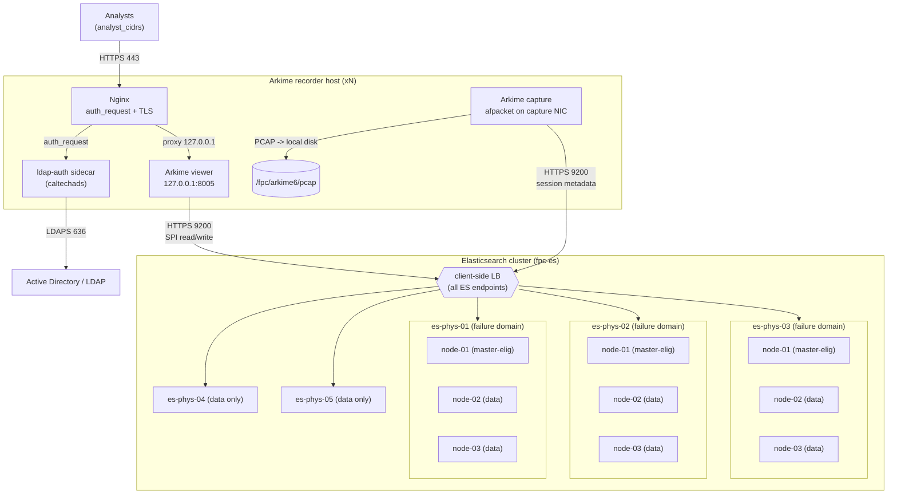

# FPC Platform Architecture

Full Packet Capture (FPC) platform: Arkime recorders capturing to local disk,
backed by a multi-node Elasticsearch (ES) cluster spread across physical hosts,
fronted by per-recorder Nginx performing LDAP/AD authentication.

## Topology



## Elasticsearch role and failure-domain design

* **Containers are derived, not inventory hosts.** Each physical host runs
  `elasticsearch_nodes_per_host` (default **3**) ES containers on host
  networking, with unique HTTP/transport ports (`9200+`/`9300+`). The
  `elasticsearch_cluster` role computes the node list, per-container memory
  limit, and heap from each host's real RAM (`ansible_memtotal_mb`).
* **Three master-eligible nodes on three distinct hosts.** `node-01` on each of
  `es_master_eligible_hosts` (exactly 3) is master-eligible. Quorum = 2 of 3, so
  the cluster survives the loss of any single host. Losing a **second** master
  host loses quorum and blocks writes — by design (split-brain prevention).
* **Failure domain = physical host.** Allocation awareness uses
  `node.attr.physical_host` with **forced** awareness
  (`cluster.routing.allocation.awareness.force`). With `es_index_replicas: 1`,
  ES never places a primary and its replica on the same physical host, so a full
  host loss can never take all copies of a shard.
* **Scale = density × hosts.** N=3/4/5 per host across 5 hosts = 15/20/25 nodes.
  See [sizing.md](sizing.md) for the heap/cache trade-offs that set the default.

## Host networking and port matrix

All containers use **host networking** (no Docker NAT) for line-rate capture and
to give every ES node a stable, directly addressable port.

| Service             | Host       | Port(s)                         | Exposure              |
|---------------------|------------|---------------------------------|-----------------------|
| ES HTTP             | ES host    | `9200 .. 9200+N-1`              | cluster + recorders   |
| ES transport        | ES host    | `9300 .. 9300+N-1`              | intra-cluster only    |
| Nginx (public)      | recorder   | `443` (+ `80` redirect)         | `analyst_cidrs`       |
| Arkime viewer       | recorder   | `8005` on `127.0.0.1`           | loopback only         |
| ldap-auth sidecar   | recorder   | loopback (auth_request backend) | loopback only         |
| Arkime capture      | recorder   | capture NIC (no listener)       | n/a                   |
| LDAPS (egress)      | recorder   | `636` to AD                     | outbound              |

The host firewall (`ufw`/`firewalld`) admits ES ports only from
`control_plane_cidrs` + cluster peers, and `443` only from `analyst_cidrs`. The
viewer is never published beyond loopback; Nginx is the sole public entrypoint.

## Bootstrap guard

First-boot cluster formation needs `cluster.initial_master_nodes`; leaving it set
forever is dangerous (it can re-bootstrap a fresh cluster and orphan data). The
`elasticsearch_cluster` role therefore:

1. Stats `es_bootstrap_marker` (`/fpc/es8/.bootstrapped`) to learn if the cluster
   was already formed.
2. Renders `cluster.initial_master_nodes` **only when not yet bootstrapped**.
3. After the cluster reports healthy, `finalize_bootstrap.yml` removes the
   setting and writes the marker.

A re-imaged host therefore **rejoins** an existing cluster and must never
re-bootstrap. The destructive init flows are additionally gated by
`confirm_destroy` / `arkime_force_init` (both default `false`).

## Image-delivery model

Default `image_delivery_mode: load_from_archive` (air-gap-friendly):

```mermaid
flowchart LR
  build["Build/AWX host"] -->|docker build / pull pinned digest| img["image:tag@sha256"]
  img -->|docker save -> .tar.gz| arc["/opt/fpc/images/*.tar.gz"]
  arc -->|ship (synchronize)| host["target host"]
  host -->|docker load| local["local image store"]
  local -->|Compose pull: never| run["running container"]
```

* Production images are **digest-pinned** (`repo@sha256:...`) via `arkime_image`,
  `es_image`, `nginx_image`, `ldap_auth_image`. Compose always runs with
  `pull: never` so a host runs exactly the loaded digest.
* Alternative `registry` mode pulls the same pinned digests from a private
  registry (credentials injected by AWX). The lab uses moving tags for
  convenience only.

## Why Compose v2, not Kubernetes

* **Host networking + NIC tuning** (afpacket, ring buffers, offload control,
  NUMA pinning) is first-class with Compose on a dedicated host; k8s CNI adds an
  overlay that fights line-rate capture.
* **Pinned, host-local data and devices.** ES data lives on dedicated block
  devices per host; the failure domain *is* the physical host. We want one
  predictable container set per host, not a scheduler relocating stateful pods.
* **Operational simplicity / smaller blast radius.** A handful of hosts managed
  by Ansible + `community.docker.docker_compose_v2` (`fpc-es`, `fpc-arkime`,
  `fpc-nginx`) is far less moving machinery than a k8s control plane for a fleet
  this size, and matches the air-gapped, AWX-driven operating model.
